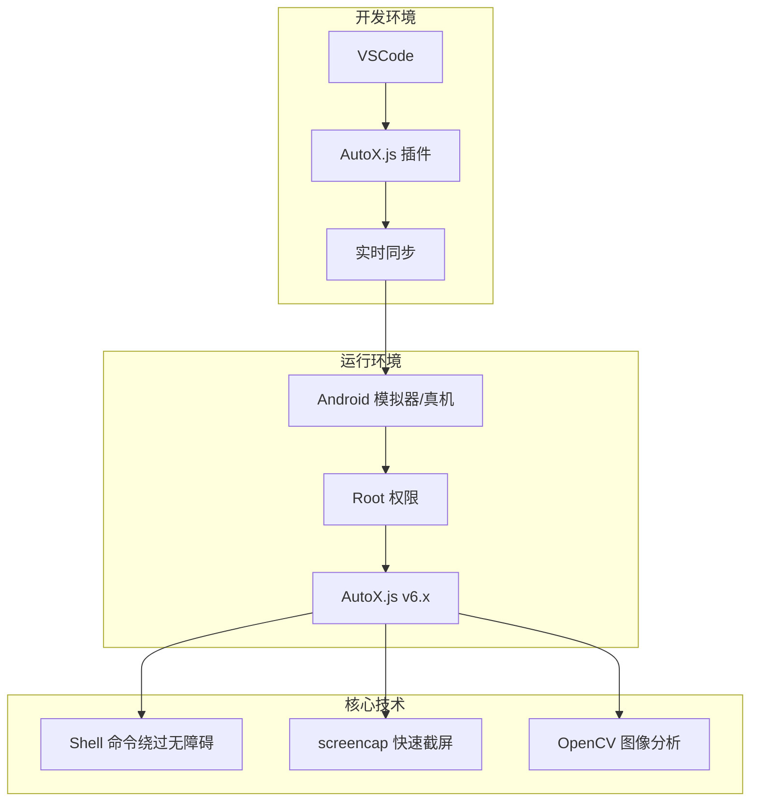

# 🎮 CoC-AutoX 自动化脚本

<p align="center">
  <strong>基于 AutoX.js 框架开发的《部落冲突》自动化辅助工具</strong>
</p>

<p align="center">
  
  
  
</p>

---

## 📖 项目概述

本项目旨在实现《部落冲突》的 **24/7 全天候资源管理**，通过图色识别与模拟点击技术，自动化完成：

- 🏠 **资源自动收割** - 定时循环检索全地图坐标，自动收集圣水、金币、黑油
- ⚔️ **死鱼智能搜索** - 基于采集器外置和储量判定的攻击目标筛选
- 🏋️ **智能训练系统** - 预设配方自动造兵
- 🤝 **自动捐赠** - 监听部落聊天，自动响应捐赠请求
- 📊 **全局状态监控** - 实时判断村庄/搜索/战斗界面

---

## 🛠️ 技术架构



| 组件 | 技术选型 |
|------|----------|
| 开发 IDE | VSCode + AutoX.js 插件 |
| 核心框架 | AutoX.js v6.x |
| 权限保障 | Root 权限 + Shell 命令 |
| 图像识别 | OpenCV 插件 |
| 通信协议 | ADB over WiFi / USB |

---

## 📂 项目结构

```
CoC-AutoX/
├── main.js              # 主入口脚本
├── utils.js             # 全局工具函数
├── project.json         # AutoX.js 项目配置
│
├── src/modules/         # 功能模块
│   ├── village/         # 村庄管理
│   ├── battle/          # 战斗系统
│   ├── train/           # 训练系统
│   └── donate/          # 捐赠系统
│
├── images/              # 图像资源 (截图模板)
├── config/              # 配置文件 (坐标、阈值)
├── logs/                # 运行日志
└── tests/               # 测试脚本
```

---

## 🚀 快速开始

### 环境要求

- ✅ Android 设备/模拟器 (已 Root)
- ✅ AutoX.js v6.x 安装并启用
- ✅ VSCode + AutoX.js 插件
- ✅ ADB 工具 (用于连接)

### 安装步骤

1. **克隆仓库**
   ```bash
   git clone https://github.com/YOUR_USERNAME/CoC-AutoX.git
   ```

2. **连接设备**
   ```bash
   adb connect <设备IP>:5555
   ```

3. **VSCode 同步**
   - 打开项目文件夹
   - 使用 AutoX.js 插件连接设备
   - 点击 "运行" 启动脚本

---

## ⚙️ 配置说明

编辑 `config/` 目录下的配置文件以适配您的设备：

```javascript
// config/coordinates.js
module.exports = {
    // 根据您的屏幕分辨率调整
    collectButton: { x: 500, y: 800 },
    attackButton: { x: 900, y: 600 },
    // ...
};
```

---

## 📜 开发规范

请阅读 [CLAUDE.md](./CLAUDE.md) 了解完整的开发规范和代码风格指南。

**核心原则：**
- 🔄 模块化开发 - 新功能放在 `src/modules/`
- 📝 配置外置 - 坐标和阈值使用配置文件
- 🧪 先测试后合并 - 使用 `tests/` 进行验证

---

## ⚠️ 免责声明

本项目仅供学习和研究使用。使用本脚本可能违反游戏服务条款，可能导致账号被封禁。**使用者需自行承担所有风险**。

---

## 📄 许可证

本项目采用 [MIT License](./LICENSE) 开源许可证。

---

<p align="center">
  Made with ❤️ for Clash of Clans automation research
</p>
